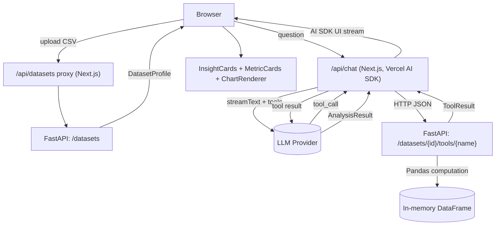

# AI Data Analyst

> Upload a CSV. Ask a question in plain English. Get a real, Pandas-computed
> answer with a chart — never a hallucinated number.

A learning project that combines **FastAPI + Pandas + Pydantic** with the
**Vercel AI SDK + Next.js** to build a small, honest system for
natural-language analysis of tabular data.

## Problem Statement

It's easy to learn Pandas in a notebook and easy to learn the Vercel AI SDK
in a chatbot demo. It's much harder — and much more useful — to learn how
to wire an LLM to a *trustworthy* computation layer: one where the model
chooses what to compute but never invents the answer itself. This project
is a deliberately small, real system built around that one hard problem.

## Goals

- Ship a working upload → ask → stream → chart flow end to end.
- Keep a hard line between what the **LLM** decides and what **Pandas**
  computes — see [Architecture](#architecture).
- Use the Vercel AI SDK's actual intended primitives (`streamText`,
  `tool()`, `useChat`) rather than reinventing streaming or tool-calling.
- Make the frontend un-crashable by a bad model output.

## Architecture



**The short version:** Next.js owns the LLM conversation and streaming
(via the Vercel AI SDK); FastAPI owns every Pandas computation. The model
never computes a number — it only picks a tool, reads the tool's answer,
and explains it. Full rationale in
[`TECHNICAL_DESIGN.md`](./TECHNICAL_DESIGN.md#2-architecture-decision-record--ai-sdk--fastapi-boundary).

## Features

- CSV upload with validation, type inference, and a dataset profile
  (row/column counts, missing values, basic stats) shown immediately.
- Natural-language questions answered via a fixed set of deterministic
  analysis tools (grouping, aggregation, percentages, correlation, simple
  time-series summaries) — no arbitrary code execution, ever.
- Streamed responses: status updates, then summary text, then insights,
  metrics, and a chart, all appearing progressively.
- A closed, validated chart-configuration schema rendered through fixed
  React chart components — the model can't inject arbitrary UI.
- Follow-up questions against the same uploaded dataset.
- Graceful failure everywhere: bad files, unanswerable questions, tool
  errors, and dropped streams all produce clear, non-crashing states.

## Tech Stack

| Layer | Technology |
|---|---|
| Monorepo | pnpm workspaces + Turborepo |
| Frontend | Next.js (App Router), TypeScript, Vercel AI SDK (`ai`, `@ai-sdk/react`) |
| Charts | Recharts, behind a fixed `ChartRenderer` |
| Backend | FastAPI, Pandas, Pydantic |
| Shared contracts | Zod schemas in `packages/schemas`, hand-mirrored from Pydantic models |
| Python env | your choice of `venv`/`uv`/`poetry` (see [Prerequisites](#prerequisites)) |

## Repository Structure

```text
ai-data-analyst/
├── apps/
│   ├── web/                    # Next.js frontend + AI orchestration
│   │   ├── app/
│   │   │   ├── api/
│   │   │   │   ├── chat/route.ts       # AI SDK streamText + tools
│   │   │   │   └── datasets/route.ts   # upload/profile proxy to FastAPI
│   │   │   └── page.tsx
│   │   ├── components/         # DatasetUploader, ChartRenderer, etc.
│   │   └── lib/ai/             # model provider abstraction, tool registry
│   │
│   └── api/                    # FastAPI backend
│       ├── app/
│       │   ├── main.py
│       │   ├── routers/        # datasets.py, tools.py, health.py
│       │   ├── services/       # ingestion, profiling
│       │   ├── tools/          # one module per analysis tool
│       │   └── models/         # Pydantic schemas
│       ├── tests/
│       └── pyproject.toml
│
├── packages/
│   └── schemas/                # Zod mirrors of the Pydantic contracts
│
├── data/
│   └── samples/
│       └── customers.csv       # sample dataset for local dev
│
├── PRD.md
├── TECHNICAL_DESIGN.md
├── README.md
└── turbo.json / pnpm-workspace.yaml
```

## Prerequisites

- Node.js (LTS) and pnpm
- Python 3.11+ and a Python environment tool of your choice (`venv`, `uv`,
  or `poetry` — the backend manages its own dependencies independently of
  the Node workspace)
- An API key for one LLM provider supported by the Vercel AI SDK

## Installation

```bash
git clone <your-repo-url>
cd ai-data-analyst

# JS/TS dependencies (frontend + shared schemas)
pnpm install

# Python dependencies (backend) — example with venv
cd apps/api
python -m venv .venv
source .venv/bin/activate        # Windows: .venv\Scripts\activate
pip install -r requirements.txt  # or: poetry install / uv sync
cd ../..
```

## Environment Variables

**`apps/web/.env.local`**

```bash
# Server-only — never exposed to the browser
AI_PROVIDER=openai              # or anthropic, etc.
AI_MODEL=gpt-4o-mini             # example — pick per current provider docs
OPENAI_API_KEY=sk-...            # matches whichever provider you set above

# Where the Next.js server reaches FastAPI
FASTAPI_BASE_URL=http://localhost:8000
```

**`apps/api/.env`**

```bash
# No LLM key here — FastAPI never talks to the LLM
MAX_UPLOAD_MB=10
DATASET_TTL_MINUTES=30
CORS_ALLOWED_ORIGINS=http://localhost:3000
```

> All AI provider secrets live only in `apps/web`'s server-side
> environment. Nothing prefixed for browser exposure (`NEXT_PUBLIC_*`)
> should ever hold a secret.

## Local Development

```bash
# Terminal 1 — backend
cd apps/api
source .venv/bin/activate
uvicorn app.main:app --reload --port 8000

# Terminal 2 — frontend
pnpm --filter web dev
# or, from the repo root, via Turborepo:
pnpm dev
```

Then open `http://localhost:3000`.

## Sample Dataset

`data/samples/customers.csv` contains customer records with:

- `id` — identifier (high-cardinality, excluded from categorical summaries)
- `name` — text
- `country` — categorical
- `age` — numeric
- `status` — categorical (`active`, `churned`, `trial`)
- `signup_date` — date
- `plan` — categorical (`free`, `pro`, `enterprise`)
- `revenue` — numeric, with a few intentionally missing values

### Example Questions to Try

- "Which countries generate the most revenue?" → `group_and_aggregate` + a
  bar chart.
- "What percentage of revenue comes from the Pro plan?" →
  `calculate_percentage` + a pie chart.
- "How has signups changed month over month?" → `time_series_summary` +
  a line chart.
- "Is age correlated with revenue?" → `calculate_correlation`, summary
  only (no chart — a single coefficient doesn't need one).
- "What's the average shoe size of our customers?" → a clean "the dataset
  doesn't contain that information" response — no crash, no guess.

## API Overview

| Endpoint | Purpose |
|---|---|
| `POST /datasets` | Upload a CSV, get back a `DatasetProfile` |
| `GET /datasets` | List datasets currently held in memory |
| `GET /datasets/{id}` | Re-fetch a profile |
| `GET /datasets/{id}/preview` | Fetch a capped, human-facing row preview (never sent to the LLM) |
| `POST /datasets/{id}/tools/{tool_name}` | Run one deterministic analysis tool |
| `DELETE /datasets/{id}` | Explicitly discard a dataset |
| `GET /health` | Liveness check |

Full request/response schemas: `TECHNICAL_DESIGN.md#12-api-design-fastapi`,
and FastAPI's own auto-generated docs at `http://localhost:8000/docs`.

## AI / Tool-Calling Explanation

The Next.js `/api/chat` route holds the entire LLM conversation. It gives
the model the dataset's profile (never raw rows) and a fixed set of tools
(`group_and_aggregate`, `filter_rows`, `calculate_percentage`,
`calculate_correlation`, `time_series_summary`, `get_column_statistics`,
`get_dataset_profile`). Each tool's `execute()` function is a thin HTTP
call into FastAPI, which runs the actual Pandas computation and returns a
capped, structured result. The model reads that result and produces the
final `AnalysisResult` — a summary, insights, metrics, and an optional
chart config — which is schema-validated before it ever reaches a React
component. See `TECHNICAL_DESIGN.md §8–§10` for the full contract.

## Streaming Explanation

Streaming happens entirely between the Next.js route and the browser,
using the Vercel AI SDK's own streaming primitives (`streamText`/
`useChat`). Status updates ("thinking", "running `group_and_aggregate`…"),
the summary text, and the structured result's fields all arrive
incrementally, so the UI fills in progressively instead of waiting for one
big response. FastAPI does not stream in the MVP — its operations are fast
enough that a plain JSON response is the right tool for the job (see
`TECHNICAL_DESIGN.md §11` for why, and when that would change).

## Testing

```bash
# Backend
cd apps/api && pytest

# Frontend
pnpm --filter web test
```

LLM behavior is tested two ways: deterministic tests mock the model's
response and assert the surrounding system (tool dispatch, schema
validation, streaming) behaves correctly; a small set of example questions
against the sample dataset are checked by hand/eval-style review, not by
exact string assertions — see `TECHNICAL_DESIGN.md §18`.

## Troubleshooting

| Symptom | Likely Cause |
|---|---|
| Upload fails immediately | File isn't a `.csv`, or exceeds `MAX_UPLOAD_MB` |
| "Dataset not found" mid-conversation | The dataset's TTL expired (default 30 min of inactivity) — re-upload |
| No chart appears | The model decided (or was forced, on invalid output) not to produce one — check `summary`/`metrics`, this is often correct behavior, not a bug |
| Chat hangs on "thinking…" | Check `AI_PROVIDER`/`AI_MODEL`/API key in `apps/web/.env.local`, and that the key matches the provider |
| CORS errors in the browser console | Confirm `CORS_ALLOWED_ORIGINS` in `apps/api/.env` includes your frontend's origin |

## Known Limitations

- Datasets live in FastAPI's process memory only — they don't survive a
  backend restart, and the backend can't be horizontally scaled as-is.
- CSV only; no Excel, JSON, or database sources.
- Multiple datasets can be uploaded and listed, but analysis always runs
  against one active dataset at a time; no multi-dataset joins.
- Recent-analyses history lives in browser local storage only — it's
  per-browser, not backed up, and unrelated to the dataset TTL.
- No authentication — not intended for public deployment as-is.
- The tool-calling loop is step-bounded; a genuinely multi-hop question
  may need to be rephrased into a more direct one.

## Roadmap

- Persist datasets (Redis or similar) to survive restarts / allow scale-out.
- A second LLM provider wired in to prove out the provider abstraction.
- More chart types (heatmap, box plot) and multi-series comparisons.
- SSE-based progress streaming from FastAPI for much larger file uploads.
- Basic auth, if ever deployed somewhere semi-public.

## Learning Objectives

By finishing this project you should be comfortably able to:

- Build a FastAPI service with Pydantic-validated multipart uploads,
  structured error responses, and a clean domain/service layering.
- Profile and safely type-infer arbitrary tabular data with Pandas.
- Design a tool-calling boundary that keeps an LLM's output trustworthy
  by construction, not by prompting alone.
- Use the Vercel AI SDK's `streamText`/`tool`/`useChat` primitives the way
  they're intended, including bounded multi-step tool loops.
- Validate and safely render model-provided structured content in React
  without ever executing model-provided code.
- Reason explicitly about where a streaming protocol is and isn't needed,
  rather than adding one everywhere by default.

---

See [`PRD.md`](./PRD.md) for the full product requirements and
[`TECHNICAL_DESIGN.md`](./TECHNICAL_DESIGN.md) for the complete
architecture, contracts, and decision records.
